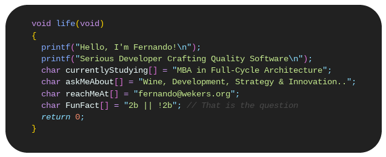

  
## About

-------------------
### Languages and Tools  
                            
  
-------------------
  

|  |  |
| ------------- | ------------- |

 

  
<!-- 
 
 
-->
  
<!--START_SECTION:waka-->
<!--END_SECTION:waka-->
