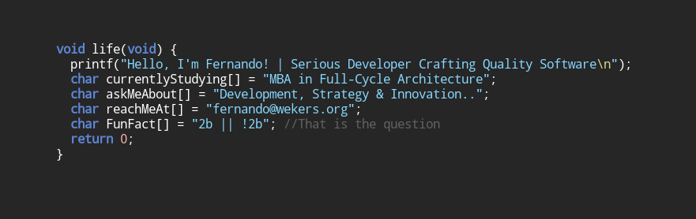

<div align="center">
  
## About
[](https://github.com/wekers)
<div align="center">
  <sub><code>full-cycle development • distributed systems • reliability • unix philosophy</code></sub>
</div>

<br/>

### 🔐 OpenPGP

WKD: fernando@wekers.org  
Fingerprint: 023C 02DA 20F5 ABC9 67AC 8860 1055 F6B8 13CD E3F3

---

### Languages & Tools
<p align="center">

  
  
  

  
  

  
  

  
  
  

  
  

</p>


---
<!-- 
src="https://github-readme-stats.vercel.app/api?username=wekers&include_all_commits=true&count_private=true&hide_border=true"
-->

<div align="center">

<table style="background:#1e1e1e; border-radius:10px; padding:10px;">
  <tr>
    <td align="center">
      <a href="https://github.com/wekers/github-readme-stats">
        
      </a>
    </td>
    <td align="center">
      <a href="https://github.com/wekers/github-readme-stats">
        
      </a>
    </td>
  </tr>
</table>

</div>


[](https://git.io/streak-stats)

<picture>
  <source media="(prefers-color-scheme: dark)" srcset="https://raw.githubusercontent.com/wekers/wekers/output/github-contribution-grid-snake-dark.svg">
  <source media="(prefers-color-scheme: light)" srcset="https://raw.githubusercontent.com/wekers/wekers/output/github-contribution-grid-snake.svg">
  
</picture>
<!-- 
<br/>
<br/>
-->
</div>

-------------------
<div align="left">
  
##### I Spent My Time On:
<!--START_SECTION:waka-->

```txt
Java                             ███████████████▒░░░░░░░░░   57.70 %
SQL                              ████████▒░░░░░░░░░░░░░░░░   21.75 %
PowerBuilder                     ████▒░░░░░░░░░░░░░░░░░░░░   11.12 %
C++                              ██▒░░░░░░░░░░░░░░░░░░░░░░   04.10 %
C                                █▒░░░░░░░░░░░░░░░░░░░░░░░   03.29 %
JSON                             ▓░░░░░░░░░░░░░░░░░░░░░░░░   02.04 %
```

<!--END_SECTION:waka-->
```text
💻 Operating System:
Linux Slackware                  ████████████████████████▒   99.00 %
FreeBSD                          ████▒░░░░░░░░░░░░░░░░░░░░   10.00 %
Windows                          █░░░░░░░░░░░░░░░░░░░░░░░░   01.00 %
```
------
</div>

<div align="center">
<table>
  <tr>
    <td>
      <a href="https://github.com/wekers/desafio-consulta-vendas">
        
      </a>
    </td>
    <td>
      <a href="https://github.com/wekers/PedidosProdutos">
        
      </a>
    </td>
   </tr>
  <tr>
    <td>
      <a href="https://github.com/wekers/TCC-RetaguardaLoja">
        
      </a>
    </td>
    <td>
      <a href="https://github.com/wekers/DesafioTDDEventCity-">
        
      </a>
    </td>
  </tr>
   <tr>
    <td>
      <a href="https://github.com/wekers/imageConvert-toGrayAndBinary">
        
      </a>
    </td>
     <td>
      <a href="https://github.com/wekers/spring-webflux-mongodb">
        
      </a>
    </td>
     </tr>
  <tr>
    <td>
      <a href="https://github.com/wekers/event-sourcing-project/tree/mongodb">
        
      </a>
    </td>
    <td>
      <a href="https://github.com/wekers/elasticsearch">
        
      </a>
    </td>
    </tr>
</table>
</div>


